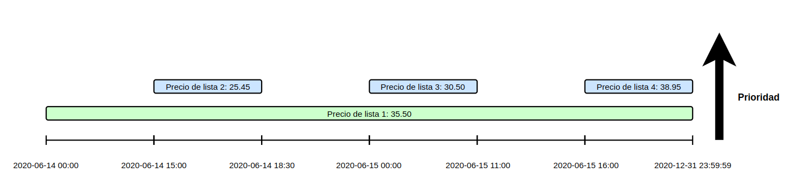
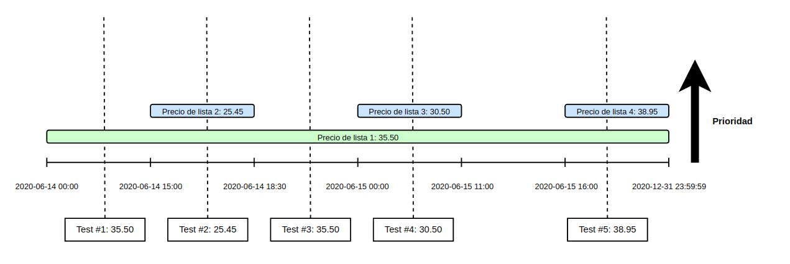

# Product price finder

Este es un pequeño proyecto de ejemplo para la búsqueda de precio de un producto según la fecha, un
identificador de cadena y el identificador del producto utilizando arquitectura hexagonal.


## Autor

- [Gomez Nicolas](https://github.com/ngomez097)


## Indice
* [Product price finder](#product-price-finder)
  * [Ejecutar los test](#ejecutar-los-test)
  * [Levantar el servidor](#levantar-el-servidor)
  * [Dependencias](#dependencias)
  * [Tecnologías](#tecnologías)
  * [Herramientas](#herramientas)
  * [Swagger](#swagger)
  * [Consideraciones](#consideraciones)
  * [Decisiones](#decisiones)
  * [Pruebas con Postman](#pruebas-con-postman)

## Ejecutar los test

Para ejecutar los test se debe correr en una terminal dentro de la carpeta del proyecto el 
siguiente comando

**Linux**
```bash
./mvnw test 
```

**Windows**
```bash
mvnw.cmd test
```


## Levantar el servidor

Para levantar el servidor se puede hacer uso del siguiente commando en una terminal

**Linux**
```bash
./mvnw spring-boot:run
```

**Windows**
```bash
mvnw.cmd spring-boot:run
```


## Dependencias

- Java 17


## Tecnologías

- [Spring Boot 3.1](https://spring.io/projects/spring-boot)
- [Spring Data JPA](https://spring.io/projects/spring-data-jpa)
- [Flyway](https://flywaydb.org/)
- [H2 Database](https://www.h2database.com/html/main.html)
- [Lombok](https://projectlombok.org/)
- [Mockito](https://site.mockito.org/)
- [JUnit 5](https://junit.org/junit5/)
- [MapStruct](https://mapstruct.org/)
- [Maven](https://maven.apache.org/)

## Herramientas

- [IntelliJ](https://www.jetbrains.com/es-es/idea/)
- [OpenApi Generator](https://openapi-generator.tech/)


## Swagger

El proyecto cuenta con **Swagger UI**, este mismo se puede acceder a través del enlace
[http://localhost:8080/swagger-ui/index.html](http://localhost:8080/swagger-ui/index.html) 
una vez que el [servidor esté corriendo](#levantar-el-servidor)


## Consideraciones

- Se establece que la moneda guardada en la base de datos en el campo `currency`
  de la tabla `price` respetará la nomenclatura [ISO 4217](https://es.wikipedia.org/wiki/ISO_4217)
- Se considera que todos los parámetros de la request son requeridos


## Decisiones

- Se usará TDD como metodología de desarrollo
- Se optó por usar `Lombok` en los modelos de dominio para mejorar la legibilidad
- Se optó por usar la etiqueta `@Query` de JPA con `JPQL` para evitar tener un **Query Method** 
  muy extenso con parámetros repetidos
- Se utilizó **OpenApi Generator** para crear el endpoint a partir de un YAML de especificación OpenAPI


## Pruebas con Postman

El proyecto está cargado con algunos datos para poder realizar pruebas, siendo estos los siguientes

| product_id | brand_id | price_list | start_date          | end_date            | priority | price | currency |
|------------|----------|------------|---------------------|---------------------|----------|-------|----------|
| 35455      | 1        | 1          | 2020-06-14T00:00:00 | 2020-12-31T23:59:59 | 0        | 35.50 | EUR      |
| 35455      | 1        | 2          | 2020-06-14T15:00:00 | 2020-06-14T18:30:00 | 1        | 25.45 | EUR      |
| 35455      | 1        | 3          | 2020-06-15T00:00:00 | 2020-06-15T11:00:00 | 1        | 30.50 | EUR      |
| 35455      | 1        | 4          | 2020-06-15T16:00:00 | 2020-12-31T23:59:59 | 1        | 38.95 | EUR      |



Las pruebas se van a realizar con los datos de la tabla siguiente siendo la última columna
los precios esperados por la API

| Número de Test | product_id | brand_id | application_date    | Precio esperado |
|----------------|------------|----------|---------------------|-----------------|
| 1              | 35455      | 1        | 2020-06-14T10:00:00 | 35.5            |
| 2              | 35455      | 1        | 2020-06-14T16:00:00 | 25.45           |
| 3              | 35455      | 1        | 2020-06-14T21:00:00 | 35.5            |
| 4              | 35455      | 1        | 2020-06-15T10:00:00 | 30.5            |
| 5              | 35455      | 1        | 2020-06-16T21:00:00 | 38.95           |



 Para correr los test en Postman se puede hacer uso de una de las dos colecciones creadas en la carpeta
 `test` que se encuentra en la raíz del proyecto, 
 
- La colección `Product Price Finder` contiene todos los test separados por request más unos test para
  comprobar errores al pasar los parámetros de forma incorrecta

- La colección `Product Price Finder FILE TEST` contiene un único request que utiliza 
  el archivo `test-data.csv` para cargar de 
  [forma parametrizada](https://learning.postman.com/docs/collections/running-collections/working-with-data-files/)
  los datos